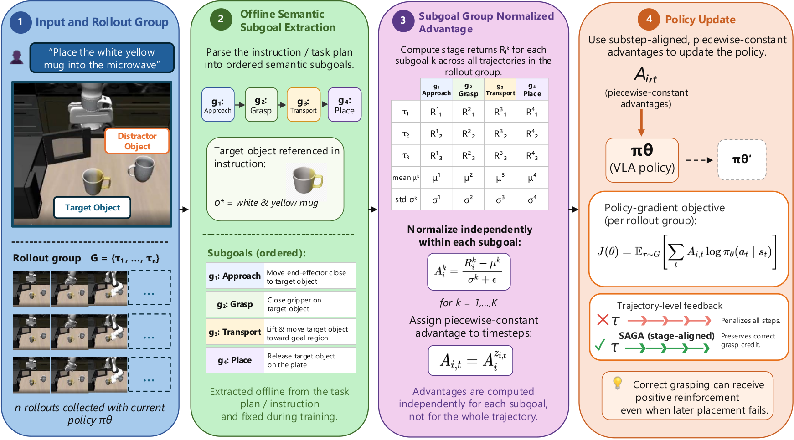

# SAGA: Subgoal-Aligned Advantage Estimation for Spatial Generalization


[](https://huggingface.co/TODO/SAGA)
[](https://huggingface.co/datasets/SCPTo/lerobot_saga)
[](LICENSE)





This repository contains the official implementation of **Subgoal-Aligned Advantage Estimation for Spatial Generalization**. SAGA is a critic-free reinforcement-learning post-training method for Vision-Language-Action (VLA) models. It addresses spatial generalization failures by aligning policy-gradient credit assignment with semantically meaningful manipulation subgoals such as approaching, grasping, transporting, and placing.

SAGA builds on **OpenVLA-OFT** and **SimpleVLA-RL**. In contrast to trajectory-level advantage estimation, which assigns a single scalar advantage to all timesteps in a rollout, SAGA computes group-normalized advantages independently within subgoal segments. This design prevents late-stage placement failures from retroactively penalizing correct early-stage grasp behavior.

## Highlights

* **Subgoal-aligned credit assignment.** SAGA decomposes manipulation trajectories into object-aware semantic subgoals and computes per-stage group advantages.
* **Critic-free RL post-training.** The method replaces only the advantage estimator in a GRPO-style VLA RL pipeline and does not require a critic, auxiliary value model, or hierarchical controller.
* **Spatial generalization.** SAGA improves robustness on LIBERO-PRO, especially under position perturbations.
* **Simulation-to-real transfer.** The trained policy can be further fine-tuned on real-world LeRobot SO-101 demonstrations.

## Repository Structure

```text
openvla-oft-yhs/
├── vla-scripts/
│   ├── finetune_substep.py          # SFT with substep labels
│   ├── finetune_real_world.py       # Real-world SO-101 fine-tuning
│   └── merge_lora_weights_and_save.py
├── SimpleVLA-RL/
│   ├── examples/run_saga_h100.sh    # H100 + Enroot/Pyxis SAGA RL entry point
│   ├── saga_rl_trail_h100.sh        # Example H100 wrapper
│   ├── saga_rl_trail.sh             # Example cluster wrapper
│   └── docker/build_h100.sh         # Build CUDA image and export Enroot sqsh
├── experiments/robot/libero/        # LIBERO evaluation utilities
├── APD_plans_scaled.json            # Subgoal plan file used by SAGA
├── SETUP.md                         # OpenVLA-OFT environment setup
└── LIBERO.md                        # LIBERO setup, data, and evaluation notes
```

## Installation

The project uses two closely related environments:

1. `openvla-oft`: supervised fine-tuning and real-world fine-tuning.
2. `simplevla`: reinforcement-learning post-training with SimpleVLA-RL / SAGA.

For reproducibility, keep the repository, LIBERO, LIBERO-PRO, and SimpleVLA-RL paths explicit rather than relying on implicit `PYTHONPATH` state.

### 1. Clone this repository

```bash
git clone https://github.com/HuskyKingdom/openvla-oft-yhs.git
cd openvla-oft-yhs
```

### 2. Install OpenVLA-OFT

This follows the setup recipe in `SETUP.md`.

```bash
conda create -n openvla-oft python=3.10 -y
conda activate openvla-oft

# Install PyTorch. Select the command appropriate for your CUDA / ROCm system.
pip3 install torch torchvision torchaudio

# Install this OpenVLA-OFT fork in editable mode.
pip install -e .

# FlashAttention is required for efficient training.
pip install packaging ninja
ninja --version; echo $?   # should return 0
pip install "flash-attn==2.5.5" --no-build-isolation
```

### 3. Install LIBERO

This follows the LIBERO instructions in `LIBERO.md`.

```bash
conda activate openvla-oft

# From the openvla-oft-yhs repository root.
git clone https://github.com/Lifelong-Robot-Learning/LIBERO.git
pip install -e LIBERO
pip install -r experiments/robot/libero/libero_requirements.txt
```

Download the standard LIBERO RLDS datasets when running OpenVLA-OFT training or evaluation:

```bash
# Example destination; change as needed.
mkdir -p /path/to/libero_data/rlds
cd /path/to/libero_data/rlds

git clone git@hf.co:datasets/openvla/modified_libero_rlds
```

Expected dataset names include:

```text
libero_spatial_no_noops
libero_object_no_noops
libero_goal_no_noops
libero_10_no_noops
```

### 4. Install LIBERO-PRO

LIBERO-PRO is used for perturbation-based evaluation of VLA spatial generalization. It is built on top of the original LIBERO benchmark and uses the same runtime environment.

```bash
conda activate openvla-oft
mkdir -p external
cd external

git clone https://github.com/Zxy-MLlab/LIBERO-PRO.git
cd LIBERO-PRO
pip install -r requirements.txt
pip install -e .
```

If LIBERO and LIBERO-PRO are both installed in editable mode, be aware that they may expose overlapping `libero` Python packages. For clean evaluation, we recommend using a dedicated evaluation environment or explicitly controlling `PYTHONPATH` before launching LIBERO-PRO jobs.

### 5. Install LIBERO-Plus data / assets

The SFT stage in this repository uses LIBERO-Plus-style data. Place the converted RLDS data under a directory such as:

```text
/work1/chunyilee/yuhang/libero_data/rlds/plus_data/
```

For a new machine, download or prepare the LIBERO-Plus training data and set:

```bash
export LIBERO_PLUS_RLDS_ROOT=/path/to/libero_data/rlds/plus_data
```

The SFT command below expects the dataset name:

```text
libero_4_task_suites_no_noops
```

### 6. Install SimpleVLA-RL

SAGA RL training is implemented in the `SimpleVLA-RL/` subdirectory and follows the SimpleVLA-RL setup recipe.

```bash
# Create a separate RL environment.
conda create -n simplevla python=3.10 -y
conda activate simplevla

# Install PyTorch for CUDA 12.4. Adjust for your system if needed.
pip3 install torch==2.4.0 --index-url https://download.pytorch.org/whl/cu124

# Clone veRL at the recommended branch. Place it at the same directory level as this repo.
cd ..
git clone -b v0.2.x https://github.com/volcengine/verl.git
cd verl
pip install -e .
cd ../openvla-oft-yhs

# Install this OpenVLA-OFT fork and training dependencies.
pip install -e .
pip install packaging ninja
ninja --version; echo $?
pip install flash-attn --no-build-isolation

# Install LIBERO if it is not already available in this environment.
git clone https://github.com/Lifelong-Robot-Learning/LIBERO.git
pip install -e LIBERO
pip install -r experiments/robot/libero/libero_requirements.txt
```

For H100 clusters, we recommend using the provided container build instead of a manually assembled environment:

```bash
# Run from the openvla-oft-yhs repository root.
bash SimpleVLA-RL/docker/build_h100.sh

# Optional: build and upload the Enroot sqsh image to a remote cluster.
UPLOAD=1 \
REMOTE_HOST=<user@h100-login> \
REMOTE_DIR=/path/to/containers \
bash SimpleVLA-RL/docker/build_h100.sh
```

## Data Preparation

### Substep labels

SFT with subgoal supervision expects a substep-label file:

```text
substep_labels_output.json
```

Place this file at the repository root, or pass its absolute path to `--substep_labels_path`. The file should align each demonstration trajectory with semantic substeps used by `vla-scripts/finetune_substep.py`.

### SAGA subgoal plan file

SAGA RL uses the APD plan file:

```text
APD_plans_scaled.json
```

For H100 / Enroot jobs, mount this file into the container through `HOST_APD_PLANS_FILE`.

## Stage 1: Supervised Fine-Tuning with Substep Labels

The following command fine-tunes OpenVLA with substep labels on the LIBERO-Plus four-suite data.

```bash
conda activate openvla-oft

# Run from the openvla-oft-yhs repository root.
torchrun --standalone --nnodes 1 --nproc-per-node 8 vla-scripts/finetune_substep.py \
  --vla_path openvla/openvla-7b \
  --substep_labels_path substep_labels_output.json \
  --data_root_dir <TODO> \
  --dataset_name libero_4_task_suites_no_noops \
  --run_root_dir <TODO> \
  --use_l1_regression True \
  --use_diffusion False \
  --use_film False \
  --num_images_in_input 2 \
  --use_proprio True \
  --batch_size 8 \
  --learning_rate 5e-4 \
  --num_steps_before_decay 100000 \
  --max_steps 150005 \
  --save_freq 50000 \
  --save_latest_checkpoint_only False \
  --image_aug True \
  --lora_rank 32 \
  --wandb_entity <TODO> \
  --wandb_project <TODO> \
  --run_id_note substep_vla
```

Notes:

* `--nproc-per-node` should match the number of GPUs on the node.
* The example uses LoRA rank 32 and the OpenVLA-OFT continuous-action / L1-regression recipe.
* Checkpoints are saved under `--run_root_dir`; use the selected SFT checkpoint as initialization for SAGA RL.

## Stage 2: SAGA Reinforcement-Learning Post-Training

SAGA RL starts from an SFT / OpenVLA-OFT checkpoint and replaces trajectory-level GRPO advantage estimation with subgoal-aligned group advantage estimation.

### H100 + Enroot/Pyxis training

Build the CUDA image first:

```bash
cd /path/to/openvla-oft-yhs
bash SimpleVLA-RL/docker/build_h100.sh
```

Then launch SAGA RL from the `SimpleVLA-RL` directory. The following wrapper-style command mirrors `saga_rl_trail_h100.sh` while leaving secrets and cluster-specific paths as environment variables.

```bash
cd /path/to/openvla-oft-yhs/SimpleVLA-RL

# Container and mount paths.
export SQSH_PATH=/path/to/simplevla-rl-cuda-saga.sqsh
export HOST_SFT_MODEL_DIR=/path/to/landmarked_ckpoints/oft_plus_discrete
export HOST_CKPT_DIR=/path/to/landmarked_ckpoints/saga_ckpts
export HOST_APD_PLANS_FILE=/path/to/openvla-oft-yhs/APD_plans_scaled.json
export HOST_REPO_OVERRIDE=/path/to/openvla-oft-yhs

# Weights & Biases. Do not hard-code private API keys in scripts.
export WANDB_API_KEY=<YOUR_WANDB_API_KEY>

# SAGA RL configuration.
export DATASET_NAME=libero_4_task_suites
export EXPERIMENT_NAME=saga-rl-libero-h100
export PROJECT_NAME=openvla-oft-rl
export NUM_GPUS=8
export NUM_NODES=1

# Generation and perturbation settings.
export USE_AUTOREGRESSIVE=False
export SWAP_OBJECTS=False
export SWAP_DISTANCE_START=0.08
export SWAP_DISTANCE_END=0.40
export SWAP_CURRICULUM_STEPS=12000

# Reward and advantage settings.
export VERIFIER_REWARD_COEF=5
export KL_COEF=0.00
export DIST_REWARD_COEF=0.0
export DIST_REWARD_SIGMA=0.05
export ADV_ESTIMATOR=saga

# Batch sizes and optimization.
export DATA_N_SAMPLES=4
export DATA_TRAIN_BATCH_SIZE=64
export DATA_VAL_BATCH_SIZE=496
export ACTOR_LR=5e-6
export ACTOR_PPO_MINI_BATCH_SIZE=128
export ACTOR_PPO_MICRO_BATCH_SIZE=8
export ACTOR_TRAJ_MINI_BATCH_SIZE=16
export ROLLOUT_MICRO_BATCH_SIZE=1
export ROLLOUT_VAL_MICRO_BATCH_SIZE=8
export ROLLOUT_TEMPERATURE=1.6
export TRAINER_SAVE_FREQ=25
export TRAINER_TEST_FREQ=4
export TRAINER_TOTAL_EPOCHS=100

sbatch examples/run_saga_h100.sh
```

Alternatively, edit the paths in the wrapper and submit directly:

```bash
cd /path/to/openvla-oft-yhs/SimpleVLA-RL
bash saga_rl_trail_h100.sh
```

### Expected RL configuration

The default SAGA RL configuration uses:

```text
Backbone:                 OpenVLA-OFT
Initialization:           SFT checkpoint
Advantage estimator:      saga
Task suite:               libero_4_task_suites / LIBERO-PRO evaluation suites
Rollouts per prompt:      4
Actor learning rate:      5e-6
KL coefficient:           0.00
Reward coefficient:       5
Input images:             1 front RGB image
Proprioception:           disabled during rollout
Training hardware:        8 NVIDIA H100 GPUs
```

## Stage 3: Real-World SO-101 Fine-Tuning

The simulation-trained SAGA policy can be adapted to a real LeRobot SO-101 setup using a small real-world dataset.

### Dataset

Download address:

```text
TODO: add the Hugging Face dataset URL here.
```

Example placeholder:

```bash
huggingface-cli download \
  --repo-type dataset TODO/SAGA-SO101-RealWorld \
  --local-dir ./data/real_world_saga
```

The training script below reads data from the Hugging Face dataset specified by `--hf_repo_id`. Replace the repository ID and task instruction as needed for the released dataset.

### Fine-tuning command

```bash
conda activate openvla-oft

# Run from the openvla-oft-yhs repository root.
torchrun --standalone --nnodes 1 --nproc-per-node 8 vla-scripts/finetune_real_world.py \
  --vla_path /work1/chunyilee/yuhang/openvla-oft-yhs/landmarked_ckpoints/global_step_49 \
  --hf_repo_id SCPTo/lerobot_saga \
  --task_instruction "Grab the purple cube then put it into the red cup" \
  --run_root_dir /work1/chunyilee/yuhang/openvla-oft-yhs/ckpoints \
  --use_l1_regression False \
  --use_diffusion False \
  --use_film False \
  --num_images_in_input 1 \
  --use_proprio False \
  --batch_size 4 \
  --learning_rate 5e-4 \
  --num_steps_before_decay 100000 \
  --max_steps 50005 \
  --save_freq 10000 \
  --save_latest_checkpoint_only False \
  --image_aug True \
  --lora_rank 32 \
  --wandb_entity "yhscode-university-of-liverpool" \
  --wandb_project "yhscode-university-of-liverpool" \
  --run_id_note real_world_saga
```

Use the exact `--task_instruction` string stored in the dataset metadata. If the dataset was recorded with a misspelled instruction string, keep the recorded string for consistency.

## Evaluation

### LIBERO-PRO evaluation
Use the evaluation scripts under:

```text
experiments/robot/libero/
```

LIBERO-Pro evaluation command has the following form:

```bash
python experiments/robot/libero/run_libero_pro_eval.py \
  --pretrained_checkpoint /path/to/checkpoint \
  --task_suite_name libero_spatial \
  --center_crop True \
  --num_trials_per_task 50
```

For LIBERO-PRO, install the LIBERO-PRO repository and point the evaluation code to the corresponding perturbation suites / configuration files. The recommended evaluation reports object, position, semantic, task, and average scores across the LIBERO-Spatial, LIBERO-Object, LIBERO-Goal, and LIBERO-10 suites.

### Real-world evaluation

For SO-101 real-world evaluation, run the policy server on the GPU machine and the robot client on the robot-control machine. Use the checkpoint produced by real-world fine-tuning and the task instruction used during data collection.
